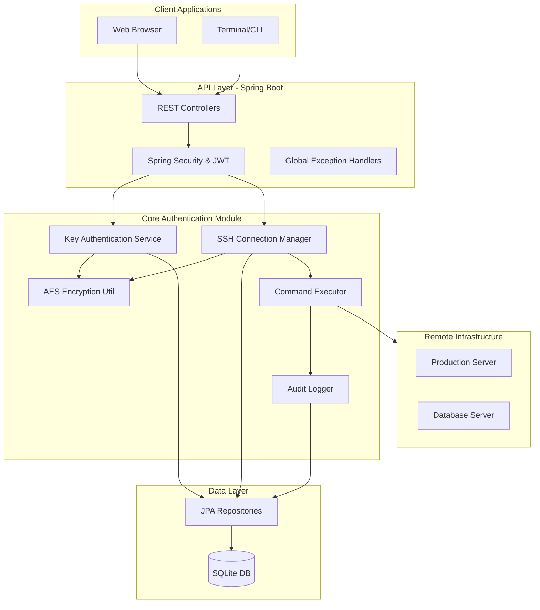

# 🔐 SSH Authentication Module

[](https://www.oracle.com/java/technologies/javase/jdk17-archive-downloads.html)
[](https://spring.io/projects/spring-boot)
[](https://www.sqlite.org/index.html)
[](https://opensource.org/licenses/MIT)


## 📖 Overview

The **SSH Authentication Module** is a enterprise-grade Spring Boot application designed to centralize and secure SSH access to remote infrastructure. It provides a robust API for SSH key lifecycle management and audited remote command execution, abstracting the complexities of the SSH protocol into simple RESTful endpoints.

---

## 🚀 Key Features

-   **SSH Key Lifecycle Management**: Securely upload, store, and validate RSA/ED25519 key pairs.
-   **Audited Command Execution**: Execute commands on remote linux servers with full output capturing and timeout management.
-   **AES-256 Encryption**: All sensitive data, including private keys, are encrypted at rest.
-   **Comprehensive Audit Trail**: Every connection and command execution is logged for security compliance.
-   **Interactive Documentation**: Fully integrated Swagger UI for API exploration.
-   **Lightweight Persistence**: Powered by SQLite for zero-config database setup.
-   **Docker Ready**: Multi-container support for seamless deployment.

---

## 🏗 System Architecture

The following diagram illustrates the high-level architecture and data flow of the system:



---

## 🛡 Security & Compliance

Security is at the heart of the SSH Authentication Module:

1.  **Encryption at Rest**: Private keys are never stored in plain text. They are encrypted using the **AES-256** algorithm before being persisted to the database.
2.  **Audit Logging**: Every sensitive operation (key upload, connection test, command execution) generates an audit log entry containing the timestamp, user ID, requested host, and execution status.
3.  **Authentication**: API endpoints are secured via Spring Security, supporting JWT-based tokenization for stateless, secure communication.
4.  **Parameter Validation**: Strict validation on all incoming DTOs ensures that hostnames, ports, and commands conform to expected patterns, preventing injection attacks.

---

## 🏁 Getting Started

### Prerequisites

-   **Java 17 JDK**
-   **Maven 3.6+**
-   **Docker & Docker Compose** (Optional for containerized setup)

### Local Setup

1.  **Clone & Prepare**:
    ```bash
    git clone <repository-url>
    cd ssh_auth/ssh_auth
    mkdir -p data logs
    ```

2.  **Build**:
    ```bash
    mvn clean install
    ```

3.  **Run**:
    ```bash
    mvn spring-boot:run
    ```
    Access the application at `http://localhost:8080`.

### Docker Deployment

Deploy the entire stack (API + Dashboard) using Docker Compose:

```bash
docker-compose up -d
```

---

## 📖 API Reference

### Key Management (`/api/v1/keys`)

| Method | Endpoint | Description |
| :--- | :--- | :--- |
| `POST` | `/upload` | Upload and encrypt a new SSH key pair |
| `GET` | `/all` | Retrieve a summary of all stored keys |
| `GET` | `/{id}` | Get details for a specific key |
| `DELETE` | `/{id}` | Securely remove a key pair from the system |
| `POST` | `/{id}/validate` | Verify the integrity of a stored key |

### SSH Operations (`/api/v1/ssh`)

| Method | Endpoint | Description |
| :--- | :--- | :--- |
| `POST` | `/connect` | Test connection to a remote host using a stored key |
| `POST` | `/execute` | Execute a command and capture STDOUT/STDERR |
| `GET` | `/status/{host}` | Retrieve current session status for a host |

**Interactive Documentation**: Visit [http://localhost:8080/swagger-ui.html](http://localhost:8080/swagger-ui.html) for detailed payload schemas and one-click testing.

---

## 💻 Monitoring & Maintenance

The application exposes standard Spring Boot Actuator endpoints for health monitoring:

-   **Health**: `http://localhost:8080/actuator/health`
-   **Metrics**: `http://localhost:8080/actuator/metrics`
-   **Logs**: Audit and application logs are stored in the `/logs` directory with daily rotation policies.

---

## 🤝 Contributing

Contributions are welcome! Please read our [Contributing Guidelines](CONTRIBUTING.md) before submitting pull requests.

## 📄 License

This project is licensed under the MIT License - see the [LICENSE](LICENSE) file for details.
